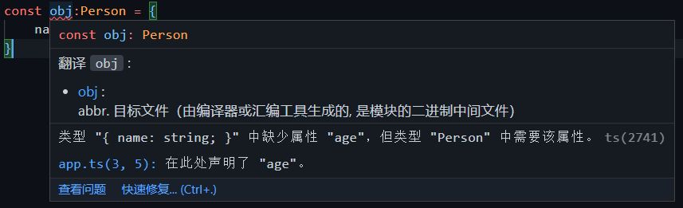
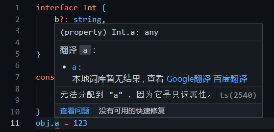

这一章主要介绍ts关于对象是如何进行类型声明和约束的

### 1、对象的类型

首先js中，我们可以任意声明一个对象，并且可以对其属性和方法进行添加、读取、删除等操作。</br>
但是在ts中,我们定义对象的方式要用到 <font color="#3eaf7c" size="4">***interface***</font> (接口),我们用它来定义一种约束，使用这个接口的数据的格式都要满足这种约束。</br>
例如：
```js
interface Person {
    name:string,
    age:number,
}
const obj:Person = {
    name:'zhangsan',
    age:18,
}
```
上面我们就是定义一个叫Person的约束，它规定的对象结构是：里面有字符串类型的name属性，和number类型的age属性,然后我们声明了一个Person类型的obj对象</br>

上面这样写是没有问题的，但是假如我们在使用Person接口约束时，定义的对象的属性缺少age属性，那么将会出现以下情况:</br>
</img>

><font color="#3eaf7c" size="4">**使用接口约束的时候不能多一个属性也不能少一个属性，必须与接口保持一致**</font>

### 2、interface 合并与继承

* 当interface重名时，会默认自动合并，如下，我们在给变量x赋值时，满足了name和age两个属性。

```js
//重名interface  可以合并
interface A {name:string}
interface A {age:number}
var x:A = {name:'xx',age:20}
```

* interface之间的继承

如下，interfaceA
```js
interface A{
    name:string
}
 
interface B extends A{  //通过继承将A的属性继承过来
    age:number
}
 
let obj:B = {
    age:18,
    name:"string"
}
```

### 3、interface中定义一个可选属性

我们前面介绍了，当接口里约定了某些属性后，我们后面依据这个接口定义的对象是不能多或少任一个属性的，
但是如果有些属性，我们不确定它是否真的存在或需要的话，我们就需要用到可选属性，
将接口内的某个属性通过 ？操作符定义为可选属性

```js
//可选属性的含义是该属性可以不存在
interface Person {
    b?:string,    //表示b属性可以不存在
    a:string
}
 
const person:Person  = {
    a:"213"
}
```

### 4、任意属性[propName: string]

需要注意的是，一旦定义了任意属性，那么确定属性和可选属性的类型都必须是它的类型的子集：

在下面的demo中，我们用Q声明的变量obj，添加了新的属性c并没有报错，
这是因为我们在Q中定义了[propName: string]: any;

它允许我们添加新的任意属性(属性的数据类型还是要与之前我们定义的[propName: string]: any保持一致的)

```js
interface Q {
    b?:string,
    a:string,
    [propName: string]: any;
}
 
const obj:Q  = {
    a:"213",
    c:"123"
}
```

### 5、只读属性 readonly
**readonly 只读属性  是不允许被赋值的，只能读取**
```js

//属性a是只读的不允许重新赋值
interface Int {
    b?: string,
    readonly a: string,
    [propName: string]: any;
}
 
const obj: Int = {
    a: "213",
    c: "123"
}
obj.a = 123    //会报错，如下图
```



### 6、添加函数

```js
interface Int {
    b?: string,
    readonly a: string,
    [propName: string]: any;
    fn():void          //定义了函数fn
}
const obj: Int = {
    a: "213",
    c: "123",
    fn:()=>{
        console.log(123)
    }
}
```

>总结：
>>* 这一章我们学习了ts中约束对象的接口定义后，一般情况下我们在根据这个接口定义对象时，数据的格式要满足这种约束，不能多或者少
>>* 接口可以通过extends继承、；
>>* 通过？操作符定义接口中某个属性为可选属性；
>>* 给接口添加[propName:string]:any 使得我们可以添加新的任意属性；
>>* 属性名前添加readonly 来规定只读属性
>>* 添加函数